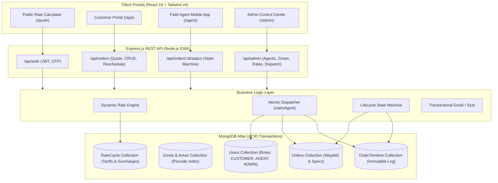
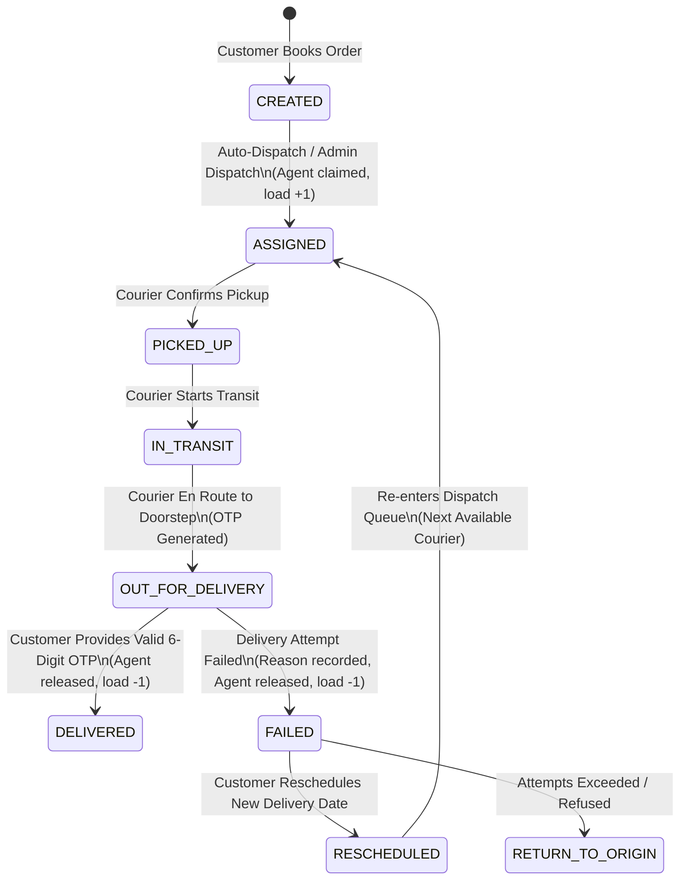

# 📦 DispatchPro — Last-Mile Delivery & Courier Management Platform

[-61DAFB?style=for-the-badge&logo=react&logoColor=black)](https://react.dev/)
[](https://nodejs.org/)
[](https://vite.dev/)
[](https://tailwindcss.com/)
[](https://www.mongodb.com/)
[](LICENSE)

**DispatchPro** is an enterprise-grade, production-ready Last-Mile Delivery & Courier Logistics Platform. Designed with a strict event-driven state machine, ACID database transactions, intelligent zone-based auto-dispatching, volumetric pricing calculations, cryptographic doorstep OTP delivery verification, and specialized role-based portals for **Customers**, **Field Couriers**, and **Logistics Administrators**.

---

## 📑 Table of Contents

1. [Key Features & System Highlights](#-key-features--system-highlights)
2. [System Architecture & Data Modeling](#-system-architecture--data-modeling)
3. [The 3 Role-Based Portals (Feature Tour)](#-the-3-role-based-portals-feature-tour)
   - [Customer Portal](#1-customer-portal-app)
   - [Field Agent Mobile Console](#2-field-agent-mobile-console-agent)
   - [Admin Operations Control Center](#3-admin-operations-control-center-admin)
4. [State Machine & Lifecycle Invariants](#-state-machine--lifecycle-invariants)
5. [Dynamic Pricing Engine & Mathematical Formulas](#-dynamic-pricing-engine--mathematical-formulas)
6. [End-to-End Walkthroughs (For Recruiters & QA)](#-end-to-end-walkthroughs-for-recruiters--qa)
   - [Happy Path: Quote → Order → Dispatch → Courier Delivery via OTP](#flow-1-happy-path-delivery)
   - [Exception Path: Delivery Failure → Reschedule Recovery → Reassignment](#flow-2-failure-exception--rescheduling-flow)
   - [Admin Operations: Fleet Capacity Management & Tariff Editing](#flow-3-admin-fleet--pricing-management)
7. [Comprehensive API Reference & Testing Guide](#-comprehensive-api-reference--testing-guide)
8. [Local Installation & Setup](#-local-installation--setup)
9. [Database Seeding & Test Credentials](#-database-seeding--test-credentials)
10. [Production Deployment (100% Free)](#-production-deployment-100-free)

---

## 🌟 Key Features & System Highlights

- **Stateless Dynamic Shipping Calculator**: Real-time zone routing and cost estimations across Delhi-NCR with volumetric calculation `(L × B × H) / 5000`.
- **Intelligent Courier Auto-Assignment**: Deterministic, race-safe atomic matching of the least-loaded available courier in the shipment's pickup zone with hard capacity invariants.
- **Append-Only Immutable Audit Trail**: Every status transition commits an immutable audit record to `OrderTimeline` within an atomic MongoDB replica-set transaction.
- **Cryptographic Doorstep OTP Handover**: 6-digit confirmation codes sent to customers, verified via bcrypt hash checks on delivery.
- **Failed Delivery Recovery**: Customers can reschedule failed shipments with new future dates, automatically clearing failures and re-entering the dispatch queue.
- **Mobile-First Courier Workspace**: One-thumb operation, 1-tap Google Maps turn-by-turn navigation, cash collection warnings, and auto-advancing 6-box OTP input.
- **Complete Admin Suite**: Live KPI command center, global orders ledger, manual dispatch control, fleet CRUD with real-time load progress meters, and dynamic Rate Card management.

---

## 🏛️ System Architecture & Data Modeling



### Core Schema Invariants

1. **`Users`**:
   - `role`: `'CUSTOMER' | 'AGENT' | 'ADMIN'`.
   - `isAvailable`: Boolean availability switch for couriers.
   - `assignedZoneId`: Foreign key to `Zone` determining courier serviceable area.
   - `currentActiveDeliveriesCount`: Monotonically incremented upon assignment, decremented on terminal statuses (`DELIVERED`, `FAILED`, `RETURN_TO_ORIGIN`).
   - `maxCapacity`: Upper limit of concurrent parcels (enforced via `$expr: { $lt: ['$currentActiveDeliveriesCount', '$maxCapacity'] }`).
2. **`Zones` & `Areas`**:
   - Areas map 6-digit postal pincodes to geographical logistics zones (e.g. `Gurugram-Faridabad` vs `South-East Delhi`).
   - Indexed uniquely by `pincode` for sub-millisecond route resolution.
3. **`RateCards`**:
   - Tiered matrix keyed by `(orderType, tripType)` — `B2C/B2B` × `INTRA_ZONE/INTER_ZONE`.
   - Dynamic parameters: `baseRate`, `baseWeight`, `additionalPerKgRate`, `codSurchargeFixed`, `codSurchargePercent`.
4. **`Orders`**:
   - Unique order identifier: `orderNumber` (e.g. `ORD-1724508920123`).
   - Dimensions (`lengthCm`, `breadthCm`, `heightCm`), billable weight, commercial B2B invoicing fields (GSTIN, Company Name), and payment mode (`isCOD`, `declaredValue`).
5. **`OrderTimeline`**:
   - **Append-only collection**: Documents are strictly created and never mutated or deleted.
   - Captures `fromStatus`, `toStatus`, `actorId`, `actorRole`, `failureReason`, `location`, `note`, and timestamp.

---

## 🖥️ The 3 Role-Based Portals (Feature Tour)

### 1. Customer Portal (`/app`, `/quote`, `/app/new`, `/app/orders/:id`, `/app/reschedule`)

Designed for shippers and eCommerce merchants to calculate freight costs, book shipments, track parcels in real time, and recover failed deliveries.

- **Stateless Shipping Calculator (`/quote`)**:
  - Lets visitors calculate exact freight rates before creating an account.
  - Automatically resolves pickup/drop pincodes to Intra-Zone or Inter-Zone.
  - Computes billable weight versus volumetric weight with a 3-column breakdown.
  - One-click *"Get Order Shipped"* button pre-fills the creation wizard.
- **4-Step Order Booking Wizard (`/app/new`)**:
  - **Step 1 (Addresses)**: Origin & destination pincode validation with street addresses and company names.
  - **Step 2 (Parcel & Payment)**: Weight, box dimensions, and payment mode selector (Prepaid vs Cash on Delivery with parcel value).
  - **Step 3 (Commercial Invoicing)**: Optional B2B tax identification (GSTIN, registered business name).
  - **Step 4 (Review & Schedule)**: Live price quote summary, scheduled date picker, and booking submission with instant waybill copy.
- **Orders Dashboard (`/app`)**: Server-side paginated orders table, 9 status filter chips, live search, and email verification reminder banner.
- **Waybill Tracking Detail (`/app/orders/:id`)**:
  - High-contrast waybill header with one-click copy.
  - 6-milestone visual stepper tracking package lifecycle.
  - Doorstep OTP security banner displaying the 6-digit confirmation code.
  - Failure exception notices with immediate reschedule recovery button.
  - Append-only immutable audit trail stream.
- **Failed Delivery Recovery (`/app/reschedule`)**: Date picker interface allowing customers to reschedule failed packages for a future date.

---

### 2. Field Agent Mobile Console (`/agent`, `/agent/orders/:id`)

Optimized specifically for couriers operating on mobile phones or on the road.

- **Mobile Task Queue (`/agent`)**:
  - Live pulse status bar (`On Duty · Mobile Mode`) and real-time load progress meter (`2 / 5 Parcels`).
  - Filter tabs: **Pending Tasks** vs **Completed History**.
  - **1-Tap Google Maps Integration**: Direct *"Maps"* button on each task card opening turn-by-turn driving directions (`https://www.google.com/maps/dir/...`).
  - **Doorstep COD Badging**: High-contrast gold badges (`COD ₹1,500`) alerting drivers to collect cash before asking for handover OTPs.
  - **Fast Workflow Actions**: Large thumb-friendly buttons to advance parcel status (`Confirm Pickup` → `Start Transit` → `Out for Delivery`).
  - **Live Auto-Sync**: Background polling every 12 seconds automatically refreshes assigned shipments.
- **Courier Action Portal (`/agent/orders/:id`)**: Full-width details, recipient call shortcut, and floating bottom action bar.
- **Deliver with OTP Modal (`DeliverOtpModal.jsx`)**: 6-box auto-advancing OTP input with `inputMode="numeric"` numeric keypad support on mobile, auto-focus, paste handling, and shake animation on incorrect OTP codes.
- **Delivery Failure Reporting (`ReportFailureModal.jsx`)**: Full-width touch radio tiles for standard failure reasons (`CUSTOMER_UNAVAILABLE`, `INCORRECT_ADDRESS`, `CUSTOMER_REFUSED`, `DOOR_LOCKED`, `CASH_NOT_READY`, `SECURITY_ACCESS_DENIED`, `OTHER`) with driver notes and GPS location inputs.

---

### 3. Admin Operations Control Center (`/admin`, `/admin/orders`, `/admin/dispatch`, `/admin/agents`, `/admin/rates`)

Central operations cockpit for logistics managers, dispatch controllers, and rate administrators.

- **Logistics Overview (`/admin`)**:
  - 5 Real-Time KPI Cards: In-Flight Shipments, Pending Dispatch Queue, Delivered Today, Exceptions / Failures, and Active Fleet Count.
  - Quick action control cards with pending count badges.
  - Recent System Activity live stream.
- **Global Orders Ledger (`/admin/orders`)**: Paginated master ledger of all shipments across all customers and zones, with 9 status filters, search, and force-dispatch action.
- **Dispatch Queue (`/admin/dispatch`)**:
  - Live dispatch board showing all unassigned `CREATED` shipments.
  - Priority attention badges for orders flagged with `needsManualAttention: true` or ≥3 retry attempts.
  - Single-order force dispatch and batch *"Auto-Dispatch All Pending"* sweep.
- **Couriers & Fleet Management (`/admin/agents`)**:
  - Fleet table with visual capacity load meters (`activeCount / maxCapacity`).
  - **Interactive Availability Switch**: One-click toggle between `Available` (green dot) and `Off-Duty` (grey dot) with instant cache synchronization.
  - **Create Courier Modal**: Onboard new field couriers with zone assignment and capacity limits.
  - **Edit Courier Modal**: Modify courier zone, capacity limit, and duty availability with visual radio cards.
- **Pricing & Rate Cards Manager (`/admin/rates`)**:
  - 4-Tier Tariff Matrix (B2C Intra-Zone, B2C Inter-Zone, B2B Intra-Zone, B2B Inter-Zone).
  - **Edit Rate Card Modal (`EditRateCardModal.jsx`)**: Modify base rates, weight allowances, incremental per-kg rates, and COD surcharges with live 2kg cost simulation.
  - **Interactive Tariff Simulator**: Test and verify live database pricing against arbitrary weights, trip types, and COD parcel values.

---

## 🔄 State Machine & Lifecycle Invariants



### Strict State Transition Rules

| From Status | Permitted Next Statuses | Actor Required | Side Effects & Invariants |
|---|---|---|---|
| `CREATED` | `ASSIGNED` | `SYSTEM` or `ADMIN` | Atomically claims least-loaded available courier in pickup zone; increments courier load. |
| `ASSIGNED` | `PICKED_UP` | `AGENT` | Validates caller is the assigned courier. |
| `PICKED_UP` | `IN_TRANSIT` | `AGENT` | Validates courier identity. |
| `IN_TRANSIT` | `OUT_FOR_DELIVERY` | `AGENT` | Issues 6-digit delivery OTP and sends email notification to customer. |
| `OUT_FOR_DELIVERY` | `DELIVERED` | `AGENT` | **Requires valid 6-digit OTP**. Decrements courier load; releases capacity slot. |
| `OUT_FOR_DELIVERY` | `FAILED` | `AGENT` | **Requires `failureReason`**. Decrements courier load; flags order for recovery. |
| `FAILED` | `RESCHEDULED` | `CUSTOMER` or `ADMIN` | **Requires future date**. Clears failure, transitions to `RESCHEDULED`, triggers re-dispatch. |
| `FAILED` | `RETURN_TO_ORIGIN` | `ADMIN` or `SYSTEM` | Terminal return status after max retry exhaustion. |

---

## 📐 Dynamic Pricing Engine & Mathematical Formulas

The pricing calculation is 100% dynamic, executing against rate cards configured in MongoDB:

### 1. Volumetric Weight Formula
$$V = \frac{\text{Length (cm)} \times \text{Breadth (cm)} \times \text{Height (cm)}}{5000}$$

### 2. Billable Weight
$$W_{\text{billable}} = \max(W_{\text{actual}}, V)$$

### 3. Extra Weight Charges
$$\Delta W = \max(0, W_{\text{billable}} - W_{\text{base}})$$
$$\text{Charge}_{\text{weight}} = \Delta W \times \text{Rate}_{\text{per\_kg}}$$

### 4. Cash on Delivery (COD) Surcharge
$$\text{Charge}_{\text{COD}} = \begin{cases} 
0 & \text{if } \text{isCOD} = \text{false} \\ 
\text{COD}_{\text{fixed}} + \left(\text{Parcel Value} \times \frac{\text{COD}_{\%}}{100}\right) & \text{if } \text{isCOD} = \text{true} 
\end{cases}$$

### 5. Total Freight Quote
$$\text{Total Amount} = \text{Base Rate} + \text{Charge}_{\text{weight}} + \text{Charge}_{\text{COD}}$$

---

## 🧪 End-to-End Walkthroughs (For Recruiters & QA)

### Flow 1: Happy Path Delivery

1. **Calculate Quote (`/quote`)**:
   - Go to `http://localhost:5173/quote`.
   - Pickup: `122001` (Gurugram) | Drop: `122018` (Gurugram).
   - Specs: `1.5 kg`, `20 × 15 × 10 cm`, Cash on Delivery with Parcel Value `₹1,000`.
   - Note the calculated Intra-Zone quote breakdown. Click **"Get Order Shipped"**.
2. **Customer Registration & Booking (`/register` → `/app/new`)**:
   - Register as `customer@example.com` / `Password123!`.
   - The creation wizard will automatically hydrate from your rate quote.
   - Advance through the 4 steps and click **"Confirm & Create Order"**.
   - Note your generated Waybill ID (e.g. `ORD-XXXXXXXXXXXXX`).
3. **Dispatch Courier (`/admin/dispatch`)**:
   - Log in as Admin (`admin@dispatchpro.com` / `AdminPass123!`).
   - Go to **Dispatch Queue** (`/admin/dispatch`).
   - Find your new order and click **"Dispatch Courier"**.
   - The order transitions to `ASSIGNED`, allocated to courier **Ravi Kumar**.
4. **Courier Mobile Workflow (`/agent`)**:
   - Log in as Courier **Ravi Kumar** (`warlord1290gaming@gmail.com` / `AgentPass123!`).
   - Click **"Confirm Pickup"** → Status becomes `PICKED_UP`.
   - Click **"Start Transit"** → Status becomes `IN_TRANSIT`.
   - Click **"Start Out for Delivery"** → Status becomes `OUT_FOR_DELIVERY`.
   - Notice the yellow COD cash collection reminder: **`COD ₹1,000`**.
5. **OTP Verification Handover**:
   - Look up the customer's 6-digit delivery OTP (visible on the Customer's order detail page at `/app/orders/:id` or logged in backend console).
   - On the courier screen, click **"Deliver (OTP)"**.
   - Enter the 6 digits in the modal.
   - Order transitions to `DELIVERED`! Ravi Kumar's active load drops back by 1.

---

### Flow 2: Failure Exception & Rescheduling Flow

1. As Courier on an `OUT_FOR_DELIVERY` order, click **"Report Failure"**.
2. Select reason: **`CUSTOMER_UNAVAILABLE`** (Customer Unavailable / Phone Unreachable), add a driver note, and submit.
3. Order transitions to `FAILED` and courier load is released.
4. As the Customer, visit `/app/orders/:id`.
5. Notice the high-contrast **Delivery Attempt Failed** exception banner.
6. Click **"Reschedule Delivery"**, pick tomorrow's date, and submit.
7. Order transitions to `RESCHEDULED` and is immediately placed back in the dispatch queue for the next available courier!

---

### Flow 3: Admin Fleet & Pricing Management

1. **Courier Fleet Management (`/admin/agents`)**:
   - View Ravi Kumar's active load progress bar (`1 / 5`).
   - Click the interactive status badge to switch Ravi to **`Off-Duty`**.
   - Attempting to auto-dispatch an order in Gurugram now flags `needsManualAttention: true` (no available agents).
   - Click **`Set Available`** — Ravi is instantly active again, absorbing waiting orders.
2. **Dynamic Tariff Management (`/admin/rates`)**:
   - Go to `/admin/rates`.
   - Click **"Edit Tariff"** on **B2C Intra-Zone**.
   - Change Base Fare from ₹40 to ₹50 and save.
   - Run a test in the built-in Tariff Simulator — the new ₹50 base price is reflected immediately without restarting the server!

---

## 📡 Comprehensive API Reference & Testing Guide

### Authentication & Profiles (`/api/auth`)

#### 1. Register Customer
```http
POST /api/auth/register
Content-Type: application/json

{
  "email": "shipper@company.com",
  "password": "SecurePassword123!",
  "fullName": "Aarav Sharma",
  "phone": "9876543210"
}
```

#### 2. Password Login
```http
POST /api/auth/login
Content-Type: application/json

{
  "email": "admin@dispatchpro.com",
  "password": "AdminPass123!"
}
```

#### 3. Request OTP (Login or Email Verification)
```http
POST /api/auth/request-otp
Content-Type: application/json

{
  "email": "shipper@company.com",
  "purpose": "VERIFY_EMAIL"
}
```

#### 4. Verify OTP
```http
POST /api/auth/verify-otp
Content-Type: application/json

{
  "email": "shipper@company.com",
  "code": "123456",
  "purpose": "VERIFY_EMAIL"
}
```

#### 5. Get Current User Session
```http
GET /api/auth/me
Authorization: Bearer <JWT_TOKEN>
```

---

### Order Management & Lifecycle (`/api/orders`)

#### 6. Generate Stateless Price Quote
```http
POST /api/orders/quote
Content-Type: application/json

{
  "orderType": "B2C",
  "pickupPincode": "122001",
  "dropPincode": "110020",
  "actualWeightKg": 2.5,
  "dimensions": { "lengthCm": 30, "breadthCm": 20, "heightCm": 15 },
  "isCOD": true,
  "declaredValue": 1500
}
```

#### 7. Create New Shipment
```http
POST /api/orders
Authorization: Bearer <CUSTOMER_JWT>
Content-Type: application/json

{
  "orderType": "B2C",
  "pickupPincode": "122001",
  "pickupAddress": "Plot 42, Cyber City, Phase 2, Gurugram",
  "dropPincode": "110020",
  "dropAddress": "Flat 302, Pocket A, Okhla Phase 1, New Delhi",
  "actualWeightKg": 1.5,
  "dimensions": { "lengthCm": 25, "breadthCm": 20, "heightCm": 10 },
  "isCOD": true,
  "declaredValue": 1200,
  "scheduledDeliveryDate": "2026-08-26"
}
```

#### 8. List Orders (Paginated & Filterable)
```http
GET /api/orders?page=1&limit=15&status=OUT_FOR_DELIVERY
Authorization: Bearer <JWT_TOKEN>
```

#### 9. Get Single Order Details
```http
GET /api/orders/:id
Authorization: Bearer <JWT_TOKEN>
```

#### 10. Get Order Audit Timeline
```http
GET /api/orders/:id/timeline
Authorization: Bearer <JWT_TOKEN>
```

#### 11. Dispatch Order (Admin Only)
```http
POST /api/orders/:id/dispatch
Authorization: Bearer <ADMIN_JWT>
```

#### 12. Advance Lifecycle Status / Deliver with OTP / Report Failure
```http
POST /api/orders/:id/status
Authorization: Bearer <AGENT_JWT>
Content-Type: application/json

# Example A: Marking DELIVERED with OTP
{
  "status": "DELIVERED",
  "deliveryOtp": "839201"
}

# Example B: Reporting Delivery FAILED
{
  "status": "FAILED",
  "failureReason": "CUSTOMER_UNAVAILABLE",
  "note": "Called 3 times, gate locked",
  "location": "Tower B Security Gate"
}
```

#### 13. Reschedule Failed Order
```http
POST /api/orders/:id/reschedule
Authorization: Bearer <CUSTOMER_JWT>
Content-Type: application/json

{
  "newDeliveryDate": "2026-08-28"
}
```

---

### Admin Operations & Fleet Management (`/api/admin`)

#### 14. List All Couriers
```http
GET /api/admin/agents
Authorization: Bearer <ADMIN_JWT>
```

#### 15. Create Courier Agent
```http
POST /api/admin/agents
Authorization: Bearer <ADMIN_JWT>
Content-Type: application/json

{
  "email": "courier.new@dispatchpro.com",
  "password": "CourierPass123!",
  "fullName": "Suresh Raina",
  "phone": "9812345678",
  "assignedZoneId": "6a8b47d7c59dc921731d4c48",
  "maxCapacity": 6
}
```

#### 16. Update Courier Availability or Capacity
```http
PATCH /api/admin/agents/:id
Authorization: Bearer <ADMIN_JWT>
Content-Type: application/json

{
  "isAvailable": true,
  "maxCapacity": 8
}
```

#### 17. List Rate Cards
```http
GET /api/admin/rates
Authorization: Bearer <ADMIN_JWT>
```

#### 18. Update Rate Card Tariff
```http
PATCH /api/admin/rates/:id
Authorization: Bearer <ADMIN_JWT>
Content-Type: application/json

{
  "baseRate": 45,
  "additionalPerKgRate": 16,
  "codSurchargeFixed": 30,
  "codSurchargePercent": 1.5
}
```

---

## 💻 Local Installation & Setup

### Prerequisites
- **Node.js**: v18.0.0 or higher
- **MongoDB**: Local instance (`mongodb://127.0.0.1:27017`) or MongoDB Atlas URI

### 1. Clone & Install Dependencies
```bash
# Clone the repository
git clone https://github.com/your-username/DispatchPro.git
cd DispatchPro

# Install Backend dependencies
cd backend
npm install

# Install Frontend dependencies
cd ../frontend
npm install
```

### 2. Configure Backend Environment
Create `backend/.env` (based on `backend/.env.example`):
```env
NODE_ENV=development
PORT=8080
CORS_ORIGIN=http://localhost:5173
MONGO_URI=mongodb://127.0.0.1:27017/dispatchpro
JWT_SECRET=super-secret-key-at-least-32-characters-long
JWT_EXPIRES_IN=7d
EMAIL_STUB=true

# Initial Admin Seeding Config
SEED_ADMIN_EMAIL=admin@dispatchpro.com
SEED_ADMIN_PASSWORD=AdminPass123!
SEED_ADMIN_NAME="System Administrator"
```

### 3. Seed the Database
```bash
cd backend
npm run seed
```
*Populates Delhi-NCR zones, 100+ postal areas, 4 active rate cards, and the system administrator account.*

### 4. Run Development Servers
```bash
# Terminal 1 — Start Backend Server (Port 8080)
cd backend
npm run dev

# Terminal 2 — Start Frontend Server (Port 5173)
cd frontend
npm run dev
```

Open your browser and navigate to **`http://localhost:5173`**.

---

## 🔑 Database Seeding & Test Credentials

The database comes pre-seeded with ready-to-use personas across all 3 roles:

| Role | Email | Password | Assigned Zone / Purpose |
|---|---|---|---|
| **Admin** | `admin@dispatchpro.com` | `AdminPass123!` | Central Operations & Pricing Manager |
| **Agent (Courier)** | `warlord1290gaming@gmail.com` | `AgentPass123!` | Field Courier (Gurugram-Faridabad Zone) |
| **Customer** | `customer@example.com` | `CustomerPass123!` | Registered Merchant / Shipper |

---

## 🚀 Production Deployment (100% Free)

DispatchPro is configured for zero-cost deployment using free-tier cloud platforms:

1. **Database**: [MongoDB Atlas](https://www.mongodb.com/cloud/atlas) (M0 Sandbox Free Forever, 512 MB).
2. **Backend API**: [Render](https://render.com) (Free Node.js Web Service with free HTTPS).
3. **Frontend SPA**: [Vercel](https://vercel.com) (Free Edge CDN, custom domain support, and SSL).

*Refer to [`DEPLOYMENT.md`](./DEPLOYMENT.md) for the complete, step-by-step free deployment walkthrough.*

---

## 🛡️ License

This project is open source and available under the [MIT License](LICENSE).
