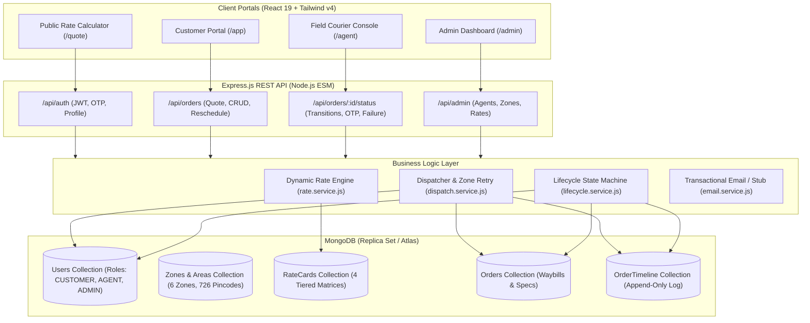
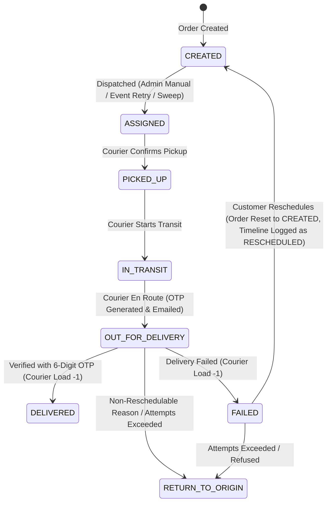

# 📦 DispatchPro — Last-Mile Delivery & Courier Management System

[-61DAFB?style=for-the-badge&logo=react&logoColor=black)](https://react.dev/)
[](https://nodejs.org/)
[](https://vite.dev/)
[](https://tailwindcss.com/)
[](https://www.mongodb.com/)
[](LICENSE)

> ⚠️ **Project Status**: The frontend is still under active development, so requests to the deployed API endpoints may occasionally encounter issues. For more reliable testing, please run the API locally and use cURL or Postman.

**DispatchPro** is a full-stack last-mile logistics and courier management platform built with the MERN stack. It features zone-based rate calculation, an order lifecycle state machine with MongoDB transaction audit trails, field courier task execution with 6-digit delivery OTP verification, failed delivery recovery with customer rescheduling, and an operations dashboard for admins.

---

### 🔑 Demo & Test User Accounts

You can access the various portals using these pre-seeded users:

| Role | Email | Password | Portal |
|---|---|---|---|
| **Admin** | `divyanshudwivedi1290@gmail.com` | `Divyanshu@123` | Admin Operations Dashboard (`/admin`) |
| **User (Customer)** | `dwivedinysa@gmail.com` | `NysaDwivedi@123` | Customer Portal (`/app`) |
| **Agent (Courier)** | `test@gmail.com` | `Test@12345` | Field Courier Mobile Console (`/agent`) |

---

## 📑 Table of Contents

1. [Key Features](#-key-features)
2. [System Architecture & Data Modeling](#-system-architecture--data-modeling)
3. [Portals Overview](#-portals-overview)
   - [Customer Portal](#1-customer-portal)
   - [Field Courier Mobile Console](#2-field-courier-mobile-console)
   - [Admin Operations Dashboard](#3-admin-operations-dashboard)
4. [State Machine & Lifecycle Transitions](#-state-machine--lifecycle-transitions)
5. [Dynamic Pricing Engine](#-dynamic-pricing-engine)
6. [Testing Flows & Local Walkthrough](#-testing-flows--local-walkthrough)
7. [API Reference](#-api-reference)
8. [Local Installation & Setup](#-local-installation--setup)
9. [Database Seeding](#-database-seeding)

---

## 🌟 Key Features

- **Stateless Shipping Calculator**: Real-time zone routing and freight cost estimation across 726 Delhi-NCR pincodes with volumetric formula `(L × B × H) / 5000`.
- **Intelligent Courier Auto-Assignment**: Deterministic, race-safe matching of the least-loaded available courier in the shipment's pickup zone using MongoDB atomic increments and capacity guards.
- **Append-Only Audit Trail**: Every status transition commits an immutable audit entry to `OrderTimeline` within an atomic MongoDB replica-set transaction.
- **Doorstep OTP Handover**: 6-digit confirmation code generated when an order transitions to `OUT_FOR_DELIVERY`, emailed to the customer, and verified via `bcrypt.compare` before marking `DELIVERED`.
- **Delivery Failure & Rescheduling**: Couriers can log standard delivery exceptions (`Customer Unavailable`, `Incorrect Address`, `Customer Refused`, `Package Damaged`). Customers can reschedule failed deliveries for a future date, resetting the order back to `CREATED` with cleared retry state.
- **Courier Mobile Console**: Compact mobile view with pending/completed tabs, quick status transition buttons (`Confirm Pickup` → `Start Transit` → `Out for Delivery`), COD cash collection badges, and OTP entry modal.
- **Admin Management Portal**: High-level orders overview, global orders ledger with status filters, manual and batch dispatch queue, courier fleet management (capacity limits and duty availability toggle), and dynamic Rate Card tariff management.

---

## 🏛️ System Architecture & Data Modeling



### Core Data Models

1. **`Users`**:
   - `role`: `'CUSTOMER' | 'AGENT' | 'ADMIN'`.
   - `isAvailable`: Availability switch for couriers.
   - `assignedZoneId`: Foreign key to `Zone` specifying the courier's serviceable region.
   - `currentActiveDeliveriesCount`: Monotonically incremented upon assignment, decremented on terminal/release statuses (`DELIVERED`, `FAILED`, `RETURN_TO_ORIGIN`).
   - `maxCapacity`: Max concurrent parcels for a courier (guarded via `$expr: { $lt: ['$currentActiveDeliveriesCount', '$maxCapacity'] }`).
2. **`Zones` & `Areas`**:
   - 6 Delhi-NCR logistics zones: `Delhi Central`, `Gurugram-Faridabad`, `Noida-Ghaziabad`, `Outer NCR Haryana`, `Outer NCR Rajasthan`, `Outer NCR UP`.
   - 726 postal pincodes mapped to zones for sub-millisecond route resolution.
3. **`RateCards`**:
   - 4-card matrix keyed by `(orderType, tripType)` — `B2C/B2B` × `INTRA_ZONE/INTER_ZONE`.
   - Configurable parameters: `baseWeight`, `baseRate`, `additionalPerKgRate`, `codSurchargeFixed`, `codSurchargePercent`.
4. **`Orders`**:
   - Unique order identifier: `orderNumber` with format `LM-YYYY-000001` (e.g. `LM-2026-000001`).
   - Package specs (`actualWeightKg`, `dimensions`), commercial B2B invoicing fields (GSTIN, Company Name), payment mode (`isCOD`, `declaredValue`), and target date (`scheduledDeliveryDate`).
5. **`OrderTimeline`**:
   - **Append-only collection**: Documents are created on each status change and never modified or deleted.
   - Captures `fromStatus`, `toStatus`, `actorId`, `actorRole`, `failureReason`, `location`, `note`, and `changedAt`.

---

## 🖥️ Portals Overview

### 1. Customer Portal (`/app`, `/quote`, `/app/new`, `/app/orders/:id`, `/app/reschedule`)

- **Stateless Shipping Calculator (`/quote`)**: Calculate estimated freight rates by entering pickup and drop pincodes, package dimensions, weight, and payment mode without logging in.
- **Order Booking Wizard (`/app/new`)**: 3-step creation wizard covering origin & destination addresses, B2B commercial invoicing (optional GSTIN), package specs, COD payment toggle, live quote preview, and target delivery date selection.
- **Customer Dashboard (`/app`)**: Paginated shipment history with 9 status filter chips and search.
- **Tracking & Audit View (`/app/orders/:id`)**: Visual stepper tracking package status, doorstep OTP notice, failure alerts with one-click reschedule navigation, and timeline audit log.
- **Reschedule Page (`/app/reschedule`)**: Date picker interface allowing customers to reschedule failed shipments for a new delivery date.

---

### 2. Field Courier Mobile Console (`/agent`, `/agent/orders/:id`)

- **Mobile Task Queue (`/agent`)**: Dedicated view with tabs for **Pending Tasks** and **Completed History**, refreshed via background polling every 12 seconds.
- **COD Badging**: High-contrast badges (`COD ₹1,500`) alerting couriers to collect cash upon delivery.
- **Workflow Actions**: Status advancement buttons (`Confirm Pickup` → `Start Transit` → `Out for Delivery`).
- **Deliver with OTP Modal (`DeliverOtpModal.jsx`)**: 6-box auto-advancing OTP input with paste support to verify customer OTP upon handover.
- **Report Delivery Failure Modal (`ReportFailureModal.jsx`)**: Standard reason options (`Customer Unavailable`, `Incorrect Address`, `Customer Refused`, `Package Damaged`) with optional driver notes and GPS location text.

---

### 3. Admin Operations Dashboard (`/admin`, `/admin/orders`, `/admin/dispatch`, `/admin/agents`, `/admin/rates`)

- **Overview Dashboard (`/admin`)**: Summary metrics strip displaying active in-flight shipments, pending dispatch queue count, delivered shipments count, exceptions, and active fleet count from current orders data.
- **Global Orders Ledger (`/admin/orders`)**: Paginated master list of all shipments across all customers and zones, with status filters, search, and force-dispatch action.
- **Dispatch Queue (`/admin/dispatch`)**: Dedicated dispatch board for unassigned `CREATED` shipments, with single-order dispatch and batch `"Auto-Dispatch All"` sweep.
- **Courier Fleet Management (`/admin/agents`)**: Courier table with visual capacity progress meters (`activeCount / maxCapacity`), interactive availability toggle switch, create courier modal, and edit courier modal.
- **Rate Cards Manager (`/admin/rates`)**: Tariff matrix editor for all 4 rate combinations with live interactive cost simulator.

---

## 🔄 State Machine & Lifecycle Transitions



### Strict State Transition Rules

| From Status | Permitted Next Statuses | Allowed Roles | Invariants & Side Effects |
|---|---|---|---|
| `CREATED` | `ASSIGNED` | `ADMIN`, `SYSTEM` | Atomically claims least-loaded available courier in pickup zone; increments courier load count. |
| `ASSIGNED` | `PICKED_UP` | `AGENT`, `ADMIN` | Verifies caller is the assigned courier (or admin). |
| `PICKED_UP` | `IN_TRANSIT` | `AGENT`, `ADMIN` | Verifies courier assignment. |
| `IN_TRANSIT` | `OUT_FOR_DELIVERY` | `AGENT`, `ADMIN` | Issues 6-digit delivery OTP (bcrypt-hashed in DB) and triggers email notification to customer. |
| `OUT_FOR_DELIVERY` | `DELIVERED` | `AGENT`, `ADMIN` | **Requires valid 6-digit OTP**. Decrements courier load count and releases capacity slot. |
| `OUT_FOR_DELIVERY` | `FAILED` | `AGENT`, `ADMIN` | **Requires `failureReason`**. Decrements courier load count; if reason is `Customer Unavailable` and failed count < 2, allows customer rescheduling. |
| `OUT_FOR_DELIVERY` | `RETURN_TO_ORIGIN` | `AGENT`, `ADMIN` | Decrements courier load count. Triggered on non-reschedulable reasons or when failed attempt count reaches cap (2). |
| `FAILED` | `CREATED` (Reschedule) | `CUSTOMER`, `ADMIN` | **Executed via `/api/orders/:id/reschedule`**. Requires future date. Records `RESCHEDULED` in timeline and resets order to `CREATED` with cleared agent and reset retry state. |

---

## 📐 Dynamic Pricing Engine

Freight pricing is computed dynamically against MongoDB `RateCards`:

### 1. Volumetric Weight
$$V = \frac{\text{Length (cm)} \times \text{Breadth (cm)} \times \text{Height (cm)}}{5000}$$

### 2. Billable Weight
$$W_{\text{billable}} = \max(W_{\text{actual}}, V)$$

### 3. Extra Weight Charges
$$\Delta W = \max(0, W_{\text{billable}} - W_{\text{base}})$$
$$\text{Charge}_{\text{weight}} = \Delta W \times \text{Rate}_{\text{per\_kg}}$$

### 4. Cash on Delivery (COD) Surcharge
$$\text{Charge}_{\text{COD}} = \begin{cases} 
0 & \text{if } \text{isCOD} = \text{false} \\ 
\text{COD}_{\text{fixed}} + \left(\text{Declared Value} \times \frac{\text{COD}_{\%}}{100}\right) & \text{if } \text{isCOD} = \text{true} 
\end{cases}$$

### 5. Total Freight Amount
$$\text{Total Amount} = \text{Base Rate} + \text{Charge}_{\text{weight}} + \text{Charge}_{\text{COD}}$$

---

## 🧪 Testing Flows & Local Walkthrough

### Flow 1: Setup Admin & Field Courier

1. Seed the database to create zones, rate cards, and the admin user:
   ```bash
   cd backend
   npm run seed
   ```
2. Log in at `http://localhost:5173/login` using your configured admin credentials (e.g. `admin@example.com`).
3. Navigate to **Couriers** (`/admin/agents`) and click **"Add New Courier"**.
4. Create a courier assigned to **Gurugram-Faridabad** zone (e.g. `courier@example.com` / `CourierPass123!`, max capacity: `5`).

---

### Flow 2: Happy Path Order Delivery

1. Open a new incognito window and go to `http://localhost:5173/register`.
2. Register a customer account (e.g. `shipper@example.com` / `ShipperPass123!`).
3. Click **"Book a Shipment"** (`/app/new`) and enter:
   - Pickup Pincode: `122001` (Gurugram)
   - Drop Pincode: `122018` (Gurugram)
   - Parcel Weight: `1.5 kg`, Dimensions: `20 × 15 × 10 cm`
   - Payment: COD with Parcel Value `₹1,000`
   - Scheduled Delivery Date: Tomorrow's date
4. Submit the booking. Note the generated tracking ID (e.g. `LM-2026-000001`).
5. As Admin, open `/admin/dispatch` and click **"Dispatch Courier"** next to the order (or dispatch via API).
6. Log out and log in as the Courier (`courier@example.com`).
7. In the courier console (`/agent`), advance the order:
   - Click **"Confirm Pickup"** (`PICKED_UP`)
   - Click **"Start Transit"** (`IN_TRANSIT`)
   - Click **"Start Out for Delivery"** (`OUT_FOR_DELIVERY`)
8. Retrieve the 6-digit delivery OTP from the customer view at `/app/orders/:id` (or from backend console logs if `EMAIL_STUB=true`).
9. As Courier, click **"Deliver (OTP)"**, enter the 6-digit code, and confirm. The order reaches `DELIVERED` and courier active load decrements.

---

### Flow 3: Delivery Failure & Customer Reschedule

1. With an order at `OUT_FOR_DELIVERY`, as the Courier click **"Report Failure"**.
2. Select **`Customer Unavailable`**, add an optional note, and submit.
3. The order transitions to `FAILED` and releases the courier's active slot.
4. As the Customer, visit `/app/orders/:id`, click **"Reschedule Delivery"**, choose a new future date, and submit.
5. The order status resets to `CREATED` (with a `RESCHEDULED` timeline entry) and re-enters the dispatch pipeline.

---

## 📡 API Reference

### Authentication (`/api/auth`)

- `POST /api/auth/register` — Register a customer account (`email`, `password`, `fullName`, `phone`).
- `POST /api/auth/login` — Authenticate and receive a JWT token (`email`, `password`).
- `POST /api/auth/request-otp` — Request 6-digit verification/login OTP (`email`, `purpose`).
- `POST /api/auth/verify-otp` — Verify OTP code (`email`, `code`, `purpose`).
- `GET /api/auth/me` — Get current user profile (requires Bearer token).

---

### Orders & Lifecycle (`/api/orders`)

- `POST /api/orders/quote` — Public rate calculation endpoint:
  ```json
  {
    "orderType": "B2C",
    "pickupPincode": "122001",
    "dropPincode": "110020",
    "actualWeightKg": 1.5,
    "dimensions": { "lengthCm": 20, "breadthCm": 15, "heightCm": 10 },
    "isCOD": true,
    "declaredValue": 1000
  }
  ```
- `POST /api/orders` — Create order (authenticated customer or admin on behalf):
  ```json
  {
    "orderType": "B2C",
    "pickupPincode": "122001",
    "pickupAddress": "Plot 42, Cyber City, Phase 2, Gurugram",
    "dropPincode": "110020",
    "dropAddress": "Flat 302, Pocket A, Okhla Phase 1, New Delhi",
    "actualWeightKg": 1.5,
    "dimensions": { "lengthCm": 20, "breadthCm": 15, "heightCm": 10 },
    "isCOD": true,
    "declaredValue": 1000,
    "scheduledDeliveryDate": "2026-08-28T00:00:00.000Z"
  }
  ```
- `GET /api/orders` — List orders (paginated, supports `?page=1&limit=20&status=CREATED`).
- `GET /api/orders/:id` — Get single order details.
- `GET /api/orders/:id/timeline` — Get audit trail events for an order.
- `POST /api/orders/:id/dispatch` — Admin manual dispatch.
- `POST /api/orders/:id/status` — Advance status / submit OTP / report failure:
  ```json
  // Delivering with OTP:
  { "status": "DELIVERED", "deliveryOtp": "123456" }

  // Reporting failure:
  { "status": "FAILED", "failureReason": "Customer Unavailable", "note": "Gate locked" }
  ```
- `POST /api/orders/:id/reschedule` — Customer/Admin reschedule for a failed order:
  ```json
  { "newDeliveryDate": "2026-08-30T00:00:00.000Z" }
  ```

---

### Admin Fleet & Rates (`/api/admin`)

- `GET /api/admin/agents` — List all couriers with live delivery load.
- `POST /api/admin/agents` — Create a new courier (`email`, `password`, `fullName`, `phone`, `assignedZoneId`, `maxCapacity`).
- `PATCH /api/admin/agents/:id` — Update courier availability, capacity, or zone (`isAvailable`, `maxCapacity`, `assignedZoneId`).
- `GET /api/admin/zones` — List active logistics zones.
- `GET /api/admin/rates` — List active rate cards.
- `PATCH /api/admin/rates/:id` — Update rate card parameters (`baseRate`, `additionalPerKgRate`, `codSurchargeFixed`, `codSurchargePercent`).

---

## 💻 Local Installation & Setup

### Prerequisites

- **Node.js**: v18.0.0 or higher
- **MongoDB**: Local replica set instance or a MongoDB Atlas URI (transactions require a replica set).

### 1. Clone & Install Dependencies

```bash
# Clone the repository
git clone https://github.com/your-username/DispatchPro.git
cd DispatchPro

# Install Backend dependencies
cd backend
npm install

# Install Frontend dependencies
cd ../frontend
npm install
```

### 2. Configure Backend Environment

Create `backend/.env` (based on `backend/.env.example`):

```env
NODE_ENV=development
PORT=8080
CORS_ORIGIN=http://localhost:5173
MONGO_URI=mongodb://127.0.0.1:27017/lastmile
JWT_SECRET=change-me-to-a-long-random-string-at-least-32-chars
JWT_EXPIRES_IN=7d

# Dev email stub (logs emails to console instead of sending via Resend)
EMAIL_STUB=true

# Admin account seeding config
SEED_ADMIN_EMAIL=admin@example.com
SEED_ADMIN_PASSWORD=change-me-to-a-secure-password
SEED_ADMIN_NAME="System Administrator"
```

### 3. Seed Database & Start Servers

```bash
# Seed zones, pincodes, rate cards, and the admin user
cd backend
npm run seed

# Start backend server (Port 8080)
npm run dev
```

In a separate terminal:

```bash
# Start frontend Vite server (Port 5173)
cd frontend
npm run dev
```

Open `http://localhost:5173` in your browser.

---

## 🔑 Database Seeding

Running `npm run seed` executes [`backend/seed.js`](./backend/seed.js), which is idempotent and populates:

1. **Admin Account**: Upserted using `SEED_ADMIN_EMAIL`, `SEED_ADMIN_PASSWORD`, and `SEED_ADMIN_NAME`.
2. **Zones & Areas**: 6 geographical zones and 726 Delhi-NCR postal pincodes from [`backend/data/pincodes.json`](./backend/data/pincodes.json).
3. **Rate Cards**: 4 default rate cards for B2C/B2B Intra-Zone and Inter-Zone trips.

*Note: Couriers and customers are not pre-seeded with hardcoded passwords. They can be created via the Admin portal (`/admin/agents`) and registration page (`/register`) respectively.*

---

## 🛡️ License

This project is open source and available under the [MIT License](LICENSE).
